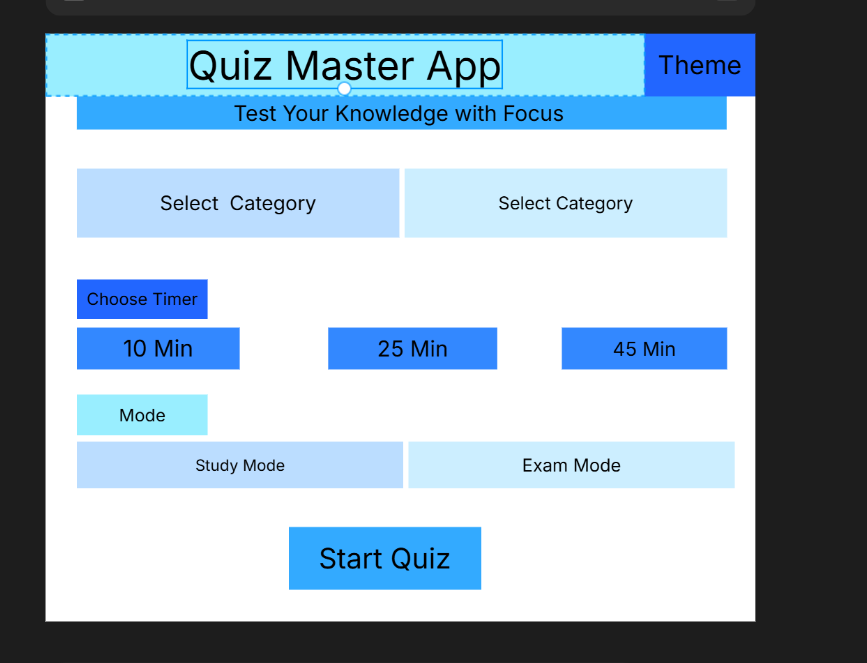
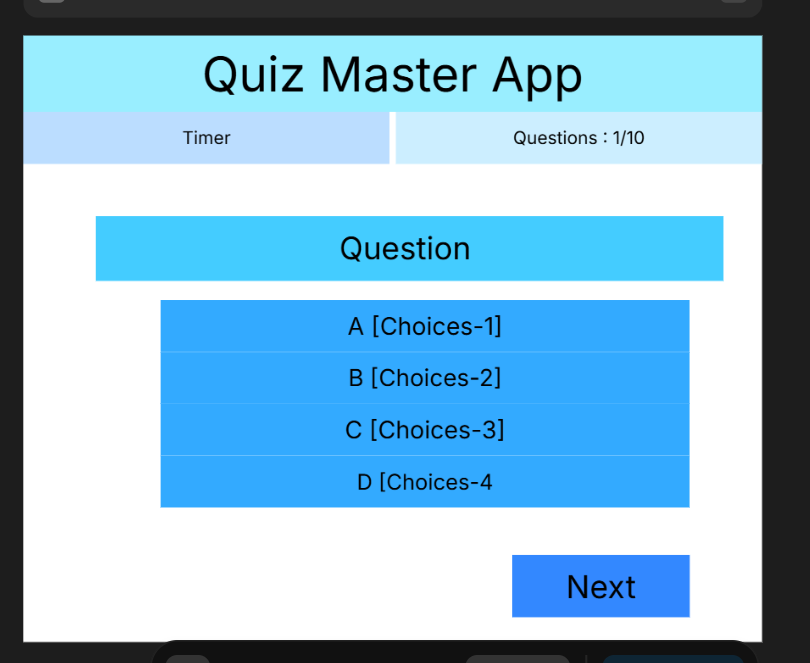
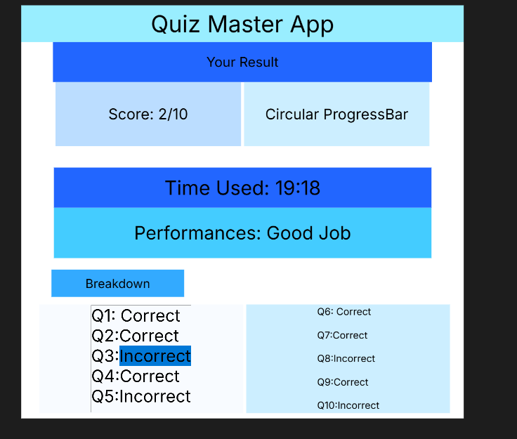

# Welcome to your Expo app 👋

This is an [Expo](https://expo.dev) project created with [`create-expo-app`](https://www.npmjs.com/package/create-expo-app).

## Get started

1. Install dependencies

   ```bash
   npm install
   ```

2. Start the app

   ```bash
   npx expo start
   ```
### App's overview

UI design for the Quiz App
Landing-Page UI

Quiz-Page

Result-Page



## 🧠 Application Logic Overview

The Quiz App follows a simple flow: **Landing Page → Quiz Page → Result Page**, controlled by a central `step` state for navigation.


### 🔹 Landing Page Logic

The landing page collects user preferences such as category (Tech, History, General, ...), difficulty (easy, medium, hard), timer, and mode (Study/Exam). The timer is converted into seconds and stored as the initial countdown value. On **Start Quiz**, inputs are validated, and the app navigates to the quiz page with initialized state.


### 🔹 Quiz Page Logic

This is the core of the app, where questions are displayed one at a time with multiple-choice options and a countdown timer.

* The timer starts immediately and updates every second
* When it reaches zero, the quiz ends automatically
* Selected answers are stored and enabled via the **Next** button
* On **Next**:

  * Answer is saved
  * Score is updated if correct
  * Moves to next question or result page if finished

#### 🎯 Answer Feedback

* **Study Mode**: Immediate feedback (correct → green, incorrect → red)
* **Exam Mode**: No feedback until the end


### 🔹 Result Page Logic

Displays a full performance summary:

* Final score (e.g., 7/10)
* Time used calculation
* Performance message:

  * High → *Excellent*
  * Medium → *Good Job*
  * Low → *Keep Practicing*
* Question-by-question breakdown
* Option to restart the quiz


### 🔹 State Management

Key states used in the app:

* `step` – navigation control
* `category`, `difficulty`, `mode` – quiz settings
* `time` – countdown timer
* `currentQuestion` – active question index
* `selectedAnswer` – current selection
* `answers` – user responses
* `score` – total correct answers


### 🔹 Timer Behavior

The global Pomodoro timer:

* Starts with the quiz
* Decrements every second
* Automatically submits the quiz when time expires

<!--  simple README update on branch 'readit' -->
---